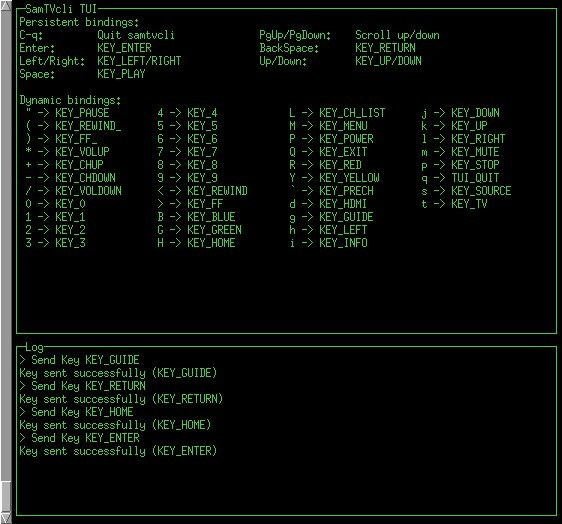

# samtvcli

`samtvcli` is a network CLI remote for Samsung TVs from 2014-2015 (I think those are models H & J).

You can use it to send keys with the command line or use its basic text user interface in a console.

I have tested it with a Samsung UE48JU6000 TV.

[](https://godoc.org/github.com/McKael/samtv)
[](https://raw.githubusercontent.com/McKael/samtv/master/LICENSE)

Get online help with `samtvcli help`.

Instead of providing IP and session information on the command line for each
invocation, you can create a YAML configuration file (expected by default at
`$HOME/.config/samtvcli/keybindings.yaml`).  There is a sample
[configuration file](samtvcli/samtvcli.yaml) in the repository.


To pair the application with the television, run
```
% samtvcli pair             # This should display the PIN page on TV
% samtvcli pair --pin CODE
```


Once paired, a basic text user interface can be used:
```
% samtvcli tui
```



The text user interface keybindings can be customized with a [YAML
configuration file](samtvcli/keybindings.yaml).

You can also use the command line and send several keys at once:

```
% samtvcli key send KEY_MENU _ KEY_RETURN KEY_VOLUP
```
